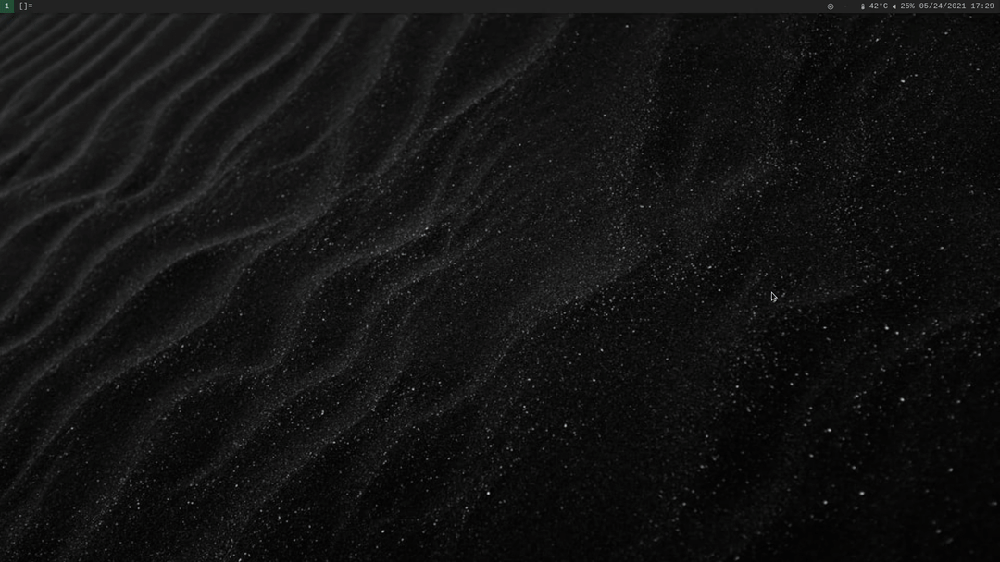

# My personal scripts for managing bookmarks for any browser.  

-Bookmarker takes what's in the clipboard and adds took bookmark files in ~/.local/bin/bookmarks. This is folder as a env variable in my startup.  
-Bookmarksurf opens browser based on input, should work for most browsers.  
-unbookmarker removes bookmark based on input  

Note that for the demo below, the script runs fast, but the browser does not (suckless surf browser). Brave and other browsers will open at normal speed.

